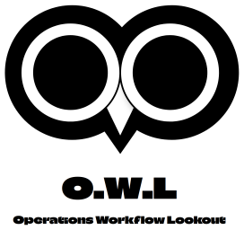

# O.W.L - Operations Workflow Lookout

An intelligent monitoring tool that watches over your GitLab CI/CD and DevSecOps ecosystem with the precision and wisdom of an owl.

<div align="center">
  
</div>

## 🦉 Project Vision

O.W.L provides a 360° view of DevSecOps operations, monitoring every aspect of your workflows with owl-like precision. From pipeline supervision to security analysis, O.W.L is your vigilant sentinel.

## ✨ Key Features

### 🔍 Night Vision (Real-time Monitoring)

* Real-time pipeline monitoring
* Instant anomaly detection
* Performance tracking
* Smart alerts

### 🌐 360° View (Global Overview)

* **Pipeline Monitor**
  
  * Multi-stage pipeline tracking
  * Build status and metrics
  * Test results and coverage
  * Deployment status

* **Security Watchtower**
  
  * SAST/DAST monitoring
  * Container security
  * Dependency scanning
  * Secret detection
  * License compliance

* **Nest Monitor (Environments)**
  
  * Docker/Podman supervision
  * Runner status
  * Resource utilization
  * Registry monitoring

### 🧠 Owl Intelligence (Smart Analytics)

* Performance metrics
* Predictive analytics
* Resource optimization
* Cost analysis
* Trend detection

## 🛠️ Technical Stack

### Main Nest (Frontend)

* React/TypeScript
* TailwindCSS
* D3.js
* Socket.IO client
* Material-UI

### Nest Foundation (Backend)

* Node.js/Express
* PostgreSQL
* Redis
* Socket.IO
* GitLab API

### Hunting Tools (DevSecOps Tools)

* Docker/Podman
* Kubernetes
* SonarQube
* OWASP ZAP
* Trivy
* Snyk

### Owl Eyes (Monitoring)

* Prometheus
* Grafana
* ELK Stack
* Jaeger

## 🦉 Why O.W.L?

O.W.L embodies the qualities of an owl:

* Sharp Vision: Precise monitoring
* Silent Watch: Optimal performance
* Wisdom: Intelligent analytics
* Night Vision: Hidden issue detection

## 🚀 Quick Start

```bash
# Clone the nest
git clone https://github.com/laissy-dev/owl

# Install dependencies
cd owl
npm install

# Configure your perch
cp .env.example .env

# Take flight (development)
npm run dev
```

## 📄 License

This project is licensed under the MIT License - see the [LICENSE](LICENSE) file for details.

## 🤝 Contributing

Contributions are welcome! Please feel free to submit a Pull Request.

## ⭐ Support

If you like this project, please give it a star on GitHub!

---

Made with 🦉 by [laissy-dev](https://github.com/laissy-dev)
